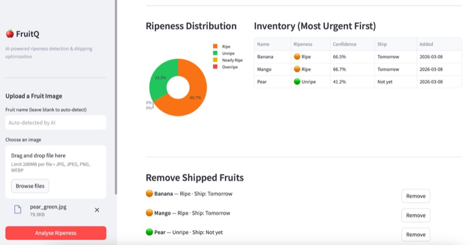

# FruitesQ

> AI-powered fruit ripeness detection and shipping optimisation.

Take a photo of a fruit, upload it, and FruitesQ tells you how ripe it is and when it should ship. The most ripe fruits always go first, reducing food waste.

---

### Dashboard preview

<p align="center">
  
</p>

---

## What it does

1. **Upload a photo** (or take one live with your webcam) of a fruit.
2. **AI identifies the fruit** (banana, mango, apple, etc.) and **classifies its ripeness** (Unripe / Nearly Ripe / Ripe / Overripe).
3. **Inventory is automatically ranked** — the most ripe fruits appear at the top.
4. **Shipping priority is assigned** so you always ship the right fruits first.

| Ripeness | Ships |
|---|---|
| Overripe | Today |
| Ripe | Tomorrow |
| Nearly Ripe | In 3 days |
| Unripe | Not yet |

---

## How it works (simple version)

```
You upload a photo
       |
  FastAPI (the backend) receives it
       |
  CLIP model (AI from OpenAI / Hugging Face)
    - identifies the fruit type
    - classifies ripeness
       |
  Result stored in inventory (sorted by urgency)
       |
  MLflow records the prediction for monitoring
       |
  Streamlit dashboard shows everything in a table
```

---

## Tech stack

| What | Tool | Why |
|---|---|---|
| AI model | CLIP (Hugging Face) | Identifies fruit and ripeness from photos — no training needed |
| Backend API | FastAPI + Python | Fast, modern REST API |
| Dashboard | Streamlit + Plotly | Interactive web UI with upload and live camera |
| Experiment tracking | MLflow | Logs every prediction for monitoring |
| Containerisation | Docker | App runs identically everywhere |
| CI/CD | GitHub Actions | Auto-tests and deploys on every push |
| Cloud deployment | Google Cloud Run | Runs the containerised app in the cloud |
| Infrastructure | Terraform | Cloud resources defined as code |

---

## Run locally (on your machine)

> **You need:** Python 3.11+ and pip installed.

**Step 1 — Get the code**

```bash
git clone https://github.com/wasimahmadpk/fruitesQ.git
cd fruitesQ
pip install -r requirements.txt
```

**Step 2 — Start the API** (open Terminal 1)

```bash
uvicorn src.api:app --reload --port 8000
```

The first time it runs, it downloads the CLIP model (~340 MB). This only happens once.

**Step 3 — Start the dashboard** (open Terminal 2)

```bash
streamlit run src/dashboard.py
```

**Step 4 — Open the app**

| Service | URL |
|---|---|
| Dashboard | http://localhost:8501 |
| API docs (Swagger) | http://localhost:8000/docs |
| Health check | http://localhost:8000/health |
| MLflow (optional) | http://localhost:5000 |

To start MLflow, open a third terminal and run:
```bash
mlflow ui --port 5000
```

---

## Run with Docker (optional)

> **You need:** Docker installed and running.

Run both the API and dashboard together with one command:

```bash
docker compose up
```

Or run just the API:

```bash
docker build -t fruitq .
docker run -p 8000:8000 fruitq
```

---

## Run the tests

```bash
pytest tests/ -v
```

Tests use a mock model — no internet or GPU needed. They run in a few seconds.

---

## API endpoints

| Method | URL | What it does |
|---|---|---|
| `POST` | `/predict` | Upload a fruit image, get ripeness result |
| `GET` | `/inventory` | List all fruits ranked by ripeness |
| `GET` | `/inventory/summary` | Count by ripeness + fruits that ship today |
| `DELETE` | `/inventory/{id}` | Remove a fruit after it ships |
| `GET` | `/health` | Check if the API is running |

**Example — upload a photo with curl:**

```bash
curl -X POST http://localhost:8000/predict \
  -F "file=@mango.jpg" \
  -F "fruit_name=mango"
```

**Example response:**

```json
{
  "fruit_name": "Mango",
  "detected_fruit": "Mango",
  "fruit_confidence": 91.2,
  "ripeness_label": "Ripe",
  "confidence": 84.3,
  "shipping_priority": "Tomorrow"
}
```

---

## CI/CD pipeline

Every time you push code to GitHub, three things happen automatically:

1. **Tests run** — `pytest tests/`
2. **Docker image built and pushed** to GitHub Container Registry (GHCR)
3. **App deployed to Google Cloud Run** via Terraform

You need these GitHub repository secrets for cloud deploy:

| Secret | What it is |
|---|---|
| `GCP_PROJECT_ID` | Your Google Cloud project ID |
| `GCP_REGION` | Cloud region (e.g. `us-central1`) |
| `GCP_SA_KEY` | Service account JSON key (full file contents) |
| `HF_TOKEN` | Hugging Face token (avoids 429 rate limit) |

See [docs/GCP_SETUP.md](docs/GCP_SETUP.md) for the full step-by-step cloud setup.

---

## Cloud deployment (Google Cloud Run)

```bash
cd terraform-gcp
terraform init -backend-config="bucket=YOUR_PROJECT_ID-fruitq-tfstate" -backend-config="prefix=fruitq"
terraform apply -var="project_id=YOUR_PROJECT_ID" -var="region=us-central1"
```

After `terraform apply` you get two URLs:

- `api_url` — the live REST API
- `dashboard_url` — the live Streamlit dashboard

---

## Monitoring the vision model on Google Cloud

To see how your CLIP model is behaving in production (errors, latency, traffic):

- **Logs** — [Cloud Run → fruitq-api → Logs](https://console.cloud.google.com/run) (model load, inference errors, stack traces).
- **Metrics** — Same service → **Metrics** tab (request count, latency, memory, CPU, error rate).
- **Alerts** — [Monitoring → Alerting](https://console.cloud.google.com/monitoring/alerting): e.g. alert when error rate or latency is high.

Full step-by-step: [docs/MONITORING.md](docs/MONITORING.md).

---

## MLflow tracking

Every prediction is logged automatically:

- Fruit name and image filename
- Ripeness label (Unripe / Nearly Ripe / Ripe / Overripe)
- Confidence score (0–100%)
- Shipping priority
- Scores for each ripeness category

If confidence drops below 60%, the prediction is tagged with `alert: low_confidence` so you can review it.

---

## Project structure

```
fruitesQ/
├── src/
│   ├── api.py           — FastAPI endpoints (REST API)
│   ├── model.py         — CLIP vision model (fruit ID + ripeness)
│   ├── inventory.py     — Inventory ranking and management
│   └── dashboard.py     — Streamlit dashboard (upload, camera, charts)
├── tests/
│   ├── test_api.py      — API integration tests
│   └── test_inventory.py— Inventory unit tests
├── .github/workflows/
│   └── ci.yml           — GitHub Actions (test → build → deploy)
├── terraform-gcp/
│   └── main.tf          — Google Cloud Run infrastructure
├── terraform/
│   └── main.tf          — Azure Container Instances (optional)
├── docs/
│   ├── GCP_SETUP.md     — Step-by-step Google Cloud setup
│   ├── MONITORING.md    — How to monitor the vision model on GCP
│   └── FruitQ_Project_Documentation.pdf
├── mlflow_tracking.py   — MLflow logging helpers
├── Dockerfile           — Multi-stage container build
├── docker-compose.yml   — Run all services together
└── requirements.txt     — Python dependencies
```

---

## Interview summary

> "I built FruitQ — an AI system that detects fruit ripeness from photos and ranks inventory so the most ripe items ship first, reducing food waste. It uses a CLIP vision model from Hugging Face, a FastAPI backend, and a Streamlit dashboard with live camera support. The app is containerised with Docker, deployed to Google Cloud Run via Terraform, and has an automated CI/CD pipeline with GitHub Actions. Every prediction is tracked in MLflow."

---

## Total cost

**$0** — all tools are free or have a free tier.
